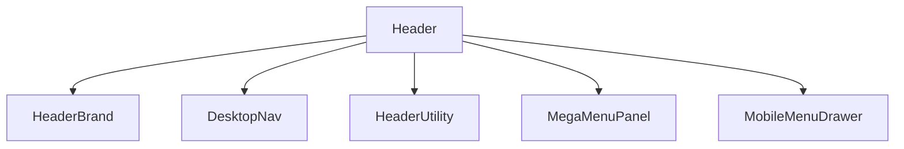

# Header Megamenu Redesign

## 목표
- 현재 [Header.tsx](C:/Users/USER/Desktop/웹페이지/frontend/src/components/common/Header.tsx) 기반 헤더를 기업형 글로벌 네비게이션 구조로 재설계한다.
- 참고 수준은 "한화 스타일의 구조와 상호작용"이며, 카피나 브랜드 요소를 그대로 복제하지 않는다.
- 핵심 목표:
  - 넓은 화이트 헤더 바
  - 중앙 1차 메뉴
  - 활성 메뉴 하단 라인
  - 전체 폭 메가메뉴 패널
  - 우측 유틸 영역
  - 모바일 전용 아코디언 메뉴

## 현재 구현의 한계
- 메뉴 데이터가 [Header.tsx](C:/Users/USER/Desktop/웹페이지/frontend/src/components/common/Header.tsx) 안에 직접 들어 있다.
- 데스크톱 드롭다운이 CSS `:hover` 중심이라 접근성과 안정성이 약하다.
- 우측 유틸 슬롯이 없다.
- 메가메뉴가 항목별 개별 패널 구조라 전체 폭 패널로 확장하기 어렵다.
- 모바일 메뉴가 단순 나열형이라 2depth가 늘어나면 답답해진다.
- 일부 공개 메뉴가 임시 경로(`/admin`, `/business/1`)를 사용한다.

## 목표 구조



## 권장 파일 구조
- [Header.tsx](C:/Users/USER/Desktop/웹페이지/frontend/src/components/common/Header.tsx)
  현재 엔트리. 상태와 조립만 담당.
- [HeaderBrand.tsx](C:/Users/USER/Desktop/웹페이지/frontend/src/components/common/HeaderBrand.tsx)
  로고 전용.
- [DesktopNav.tsx](C:/Users/USER/Desktop/웹페이지/frontend/src/components/common/DesktopNav.tsx)
  1차 메뉴와 활성 상태 표시.
- [MegaMenuPanel.tsx](C:/Users/USER/Desktop/웹페이지/frontend/src/components/common/MegaMenuPanel.tsx)
  데스크톱 메가메뉴 패널.
- [MobileMenuDrawer.tsx](C:/Users/USER/Desktop/웹페이지/frontend/src/components/common/MobileMenuDrawer.tsx)
  모바일 아코디언 드로어.
- [header-menu.ts](C:/Users/USER/Desktop/웹페이지/frontend/src/config/header-menu.ts)
  메뉴 데이터 정의.
- [navigation.ts](C:/Users/USER/Desktop/웹페이지/frontend/src/types/navigation.ts)
  메뉴 타입 정의.
- [Header.module.css](C:/Users/USER/Desktop/웹페이지/frontend/src/components/common/Header.module.css)
  공통 레이아웃과 상태 클래스.

## 메뉴 데이터 스케치

```ts
export interface HeaderMenuChild {
  id: string
  label: string
  href: string
  description?: string
}

export interface HeaderMenuSection {
  id: 'about' | 'business' | 'news' | 'careers'
  label: string
  href: string
  matchPaths: string[]
  summary?: string
  children: HeaderMenuChild[]
  featured?: {
    title: string
    description: string
    href: string
  }
}

export interface HeaderUtilityItem {
  id: string
  label: string
  href?: string
  kind: 'link' | 'button'
}
```

## Header JSX 스케치

```tsx
function Header() {
  const [scrolled, setScrolled] = useState(false)
  const [desktopOpenKey, setDesktopOpenKey] = useState<string | null>(null)
  const [mobileOpen, setMobileOpen] = useState(false)
  const [expandedMobileKey, setExpandedMobileKey] = useState<string | null>(null)

  const activeSection = useMemo(
    () => getActiveSection(menuSections, location.pathname),
    [location.pathname],
  )

  const openSection = menuSections.find((section) => section.id === desktopOpenKey) ?? null

  return (
    <header
      className={styles.header}
      data-scrolled={scrolled}
      data-open={Boolean(openSection)}
    >
      <div className={styles.topBar}>
        <HeaderBrand />

        <DesktopNav
          activeSectionId={activeSection?.id ?? null}
          onClose={() => setDesktopOpenKey(null)}
          onOpen={setDesktopOpenKey}
          sections={menuSections}
        />

        <HeaderUtility items={utilityItems} />

        <button
          aria-controls="mobile-menu-drawer"
          aria-expanded={mobileOpen}
          aria-label={mobileOpen ? '메뉴 닫기' : '메뉴 열기'}
          className={styles.mobileToggle}
          onClick={() => setMobileOpen((current) => !current)}
          type="button"
        />
      </div>

      <MegaMenuPanel
        onClose={() => setDesktopOpenKey(null)}
        openSection={openSection}
      />

      <MobileMenuDrawer
        expandedKey={expandedMobileKey}
        isOpen={mobileOpen}
        onClose={() => setMobileOpen(false)}
        onToggleSection={setExpandedMobileKey}
        sections={menuSections}
        utilityItems={utilityItems}
      />
    </header>
  )
}
```

## DesktopNav JSX 스케치

```tsx
interface DesktopNavProps {
  sections: HeaderMenuSection[]
  activeSectionId: string | null
  onOpen: (sectionId: string) => void
  onClose: () => void
}

function DesktopNav({
  sections,
  activeSectionId,
  onOpen,
  onClose,
}: DesktopNavProps) {
  return (
    <nav aria-label="주요 메뉴" className={styles.primaryNav}>
      <ul className={styles.primaryList}>
        {sections.map((section) => {
          const isActive = activeSectionId === section.id

          return (
            <li
              className={styles.primaryItem}
              key={section.id}
              onMouseEnter={() => onOpen(section.id)}
              onMouseLeave={onClose}
            >
              <button
                aria-expanded={isActive}
                className={styles.primaryTrigger}
                type="button"
              >
                <span>{section.label}</span>
              </button>
            </li>
          )
        })}
      </ul>
    </nav>
  )
}
```

## MegaMenuPanel JSX 스케치

```tsx
interface MegaMenuPanelProps {
  openSection: HeaderMenuSection | null
  onClose: () => void
}

function MegaMenuPanel({ openSection, onClose }: MegaMenuPanelProps) {
  return (
    <div
      aria-hidden={!openSection}
      className={styles.megaLayer}
      data-open={Boolean(openSection)}
      onMouseLeave={onClose}
    >
      {openSection ? (
        <div className={`${styles.megaPanel} container`}>
          <div className={styles.megaIntro}>
            <p className={styles.megaEyebrow}>{openSection.label}</p>
            <h2 className={styles.megaTitle}>{openSection.featured?.title ?? openSection.label}</h2>
            <p className={styles.megaSummary}>
              {openSection.featured?.description ?? openSection.summary}
            </p>
            <Link className={styles.megaOverviewLink} to={openSection.href}>
              전체 보기
            </Link>
          </div>

          <div className={styles.megaColumns}>
            {openSection.children.map((child) => (
              <Link className={styles.megaItem} key={child.id} to={child.href}>
                <strong>{child.label}</strong>
                {child.description ? <span>{child.description}</span> : null}
              </Link>
            ))}
          </div>
        </div>
      ) : null}
    </div>
  )
}
```

## MobileMenuDrawer JSX 스케치

```tsx
function MobileMenuDrawer({
  isOpen,
  sections,
  expandedKey,
  onToggleSection,
  onClose,
  utilityItems,
}: MobileMenuDrawerProps) {
  return (
    <>
      <div className={styles.mobileBackdrop} data-open={isOpen} onClick={onClose} />

      <aside
        aria-label="모바일 메뉴"
        className={styles.mobileDrawer}
        data-open={isOpen}
        id="mobile-menu-drawer"
      >
        <div className={styles.mobileDrawerHeader}>
          <strong>메뉴</strong>
          <button onClick={onClose} type="button">닫기</button>
        </div>

        <div className={styles.mobileUtilityRow}>
          {utilityItems.map((item) => (
            <button key={item.id} type="button">{item.label}</button>
          ))}
        </div>

        <div className={styles.mobileAccordion}>
          {sections.map((section) => {
            const expanded = expandedKey === section.id

            return (
              <section className={styles.mobileSection} key={section.id}>
                <button
                  aria-expanded={expanded}
                  className={styles.mobileSectionTrigger}
                  onClick={() => onToggleSection(expanded ? null : section.id)}
                  type="button"
                >
                  {section.label}
                </button>

                {expanded ? (
                  <div className={styles.mobileSectionBody}>
                    <Link to={section.href}>전체 보기</Link>
                    {section.children.map((child) => (
                      <Link key={child.id} to={child.href}>{child.label}</Link>
                    ))}
                  </div>
                ) : null}
              </section>
            )
          })}
        </div>
      </aside>
    </>
  )
}
```

## 상태 모델
- `scrolled`
  sticky 헤더의 투명/솔리드 상태.
- `desktopOpenKey`
  데스크톱에서 열린 1차 메뉴.
- `mobileOpen`
  모바일 드로어 열림 상태.
- `expandedMobileKey`
  모바일에서 열린 아코디언 섹션.

상태는 합치지 않는다.
- 데스크톱 메가메뉴와 모바일 드로어는 별도 상태로 관리.
- 리사이즈 시 모바일 상태 초기화 필요.

## CSS 구조 스케치

```css
.header {}
.header[data-scrolled='true'] {}
.header[data-open='true'] {}

.topBar {}
.brandArea {}
.primaryNav {}
.primaryList {}
.primaryItem {}
.primaryTrigger {}
.primaryTrigger[data-active='true']::after {}

.utilityArea {}
.utilityChip {}

.megaLayer {}
.megaLayer[data-open='true'] {}
.megaPanel {}
.megaIntro {}
.megaColumns {}
.megaItem {}

.mobileBackdrop {}
.mobileBackdrop[data-open='true'] {}
.mobileDrawer {}
.mobileDrawer[data-open='true'] {}
.mobileAccordion {}
.mobileSection {}
.mobileSectionTrigger {}
.mobileSectionBody {}
```

## 디자인 규칙
- 헤더는 기본적으로 화이트 바를 유지하고, 홈 hero 위에서는 투명/반투명 여부를 선택적으로 둔다.
- 1차 메뉴는 중앙 정렬, active line은 오렌지 포인트 컬러 사용.
- 메가메뉴 패널은 헤더 바로 아래에 붙고, `container` 기준 내부 정렬을 맞춘다.
- 패널은 둥근 카드보다 "넓은 패널 + 구분선 + 넓은 여백" 쪽이 목표와 더 맞다.
- 우측 유틸은 최대 2~3개로 제한한다.

## 접근성 기준
- 1차 메뉴 트리거는 `button` 우선.
- `aria-expanded`, `aria-controls`, `Escape` 닫기 지원.
- 메가메뉴는 `hover-only` 금지. `focus`로도 열려야 한다.
- 모바일 드로어는 첫 포커스 이동과 닫을 때 포커스 복귀가 필요하다.
- 배경 스크롤 잠금은 모바일 드로어에만 적용.

## 테스트 범위
- 단위 테스트
  - active 메뉴 판별
  - 모바일 드로어 토글
  - 모바일 아코디언 열림/닫힘
  - 리사이즈 시 상태 초기화
- E2E
  - 데스크톱 hover로 메가메뉴 열림
  - 키보드 focus로 메가메뉴 이동
  - `/about/history`에서 상위 메뉴 active 유지
  - 모바일에서 드로어 열기/닫기
  - 모바일에서 2depth 펼침과 링크 이동

## 구현 순서
1. 메뉴 IA 확정
2. `header-menu.ts`와 `navigation.ts` 생성
3. `Header.tsx`를 상태 조립형으로 축소
4. `DesktopNav`, `MegaMenuPanel`, `MobileMenuDrawer` 추가
5. `Header.module.css` 재구성
6. active 상태와 유틸 영역 보정
7. 단위 테스트
8. E2E와 반응형 QA

## 미결정 사항
- 우측 유틸에 넣을 실제 항목
- 상위 메뉴를 링크로 둘지 버튼으로 둘지
- 아직 없는 메뉴의 노출 정책
- 홈에서 투명 헤더를 유지할지, 항상 화이트 헤더로 갈지
